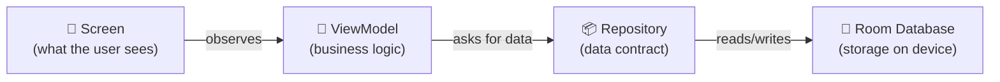
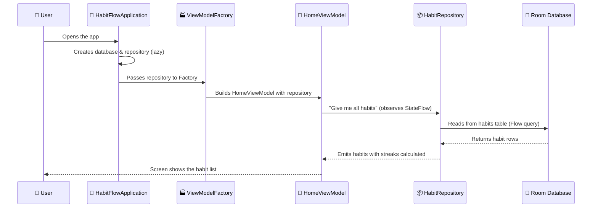

# How the Architecture & Structure Works
### A beginner-friendly guide to HabitFlow's MVVM + Repository pattern

---

## 🧠 The Big Picture: Why Do We Need "Architecture"?

Imagine building a house. You *could* put the kitchen, bedroom, and bathroom all in one room — it would technically work, but it would be messy, hard to maintain, and impossible to renovate later.

Software architecture is the same idea. Instead of dumping all the code into one giant file, we **split it into layers** where each layer has exactly one job. In HabitFlow, that pattern is called **MVVM + Repository**.

Here's the entire app flow in one sentence:

> **The Screen shows data → The ViewModel decides what to show → The Repository delivers the data → The Database stores it.**



Each arrow only points **one direction** — the Screen never talks to the Database directly, and the Database never tells the Screen what to show. This separation is the heart of the architecture.

---

## 📂 The Three Key Files

Section A has three files, and each one plays a specific role in holding this system together:

| File | Role in plain English |
|---|---|
| `HabitFlowApplication.kt` | The **startup manager** — creates shared resources when the app launches |
| `HabitRepository.kt` | The **contract** — defines *what* data operations exist, without saying *how* |
| `ViewModelFactory.kt` | The **builder** — constructs each ViewModel with the tools it needs |

Let's walk through each one.

---

## 1️⃣ HabitFlowApplication — The Startup Manager

### What is it?

When you tap the HabitFlow icon on your phone, Android creates **one instance** of `HabitFlowApplication` before anything else happens. It stays alive the entire time the app is open. Think of it as the **manager who opens the restaurant in the morning** — they unlock the doors, turn on the lights, and set up the kitchen before any customers arrive.

### What does it set up?

```
HabitFlowApplication
├── database        → The filing cabinet (Room Database)
├── repository      → The librarian who fetches files from the cabinet
└── themePreferences → Remembers if the user prefers light or dark mode
```

### Why `by lazy`?

You'll see this in the code:
```kotlin
val database: HabitDatabase by lazy { HabitDatabase.getInstance(this) }
```

`by lazy` means: **"Don't create this until someone actually asks for it."**

It's like a restaurant that doesn't heat up the deep fryer until a customer orders fries. This saves memory and speeds up app startup — the database connection isn't created until a screen actually needs habit data.

### Why does this matter?

Without `HabitFlowApplication`, every screen would have to create its own database connection. That would mean:
- ❌ Multiple connections fighting over the same data
- ❌ Each screen duplicating setup code
- ❌ No guarantee everyone uses the same data

With it:
- ✅ One database, one repository, shared by all screens
- ✅ Consistent data everywhere
- ✅ Setup code written once

---

## 2️⃣ HabitRepository — The Contract

### What is it?

`HabitRepository` is an **interface** — a word that means "a list of promises." It says: *"Any data source that wants to supply habit data MUST be able to do these things."* But it never says *how* to do them.

Think of it like a **job description**:

> "We need someone who can:
> - Provide a live list of all habits ✔
> - Add a new habit ✔
> - Delete a habit ✔
> - Toggle today's completion ✔
> - Get weekly progress ✔"

The job description doesn't care if the person is a senior developer or a junior intern — as long as they can do the work.

### Why use an interface instead of just writing the code?

This is one of the most important design decisions in the whole app. Here's a real-world analogy:

> Imagine you order food through a delivery app. You tap "Order Pizza." You don't care whether the pizza comes from Domino's, Pizza Hut, or a local shop. **The delivery app is the interface** — it promises "you'll get pizza," but the *actual source* can change without you knowing.

In HabitFlow:
- **Right now**, the data comes from a local Room database (`RoomHabitRepository`).
- **In MCO 2**, a cloud version could be swapped in (e.g., `FirebaseHabitRepository`).
- **During testing**, a fake version can be used (`FakeDataSource`) that returns sample data instantly.

**None of the screens need to change.** They only talk to the interface, so they don't care what's behind it.

### The three "live streams"

The interface defines three `StateFlow` properties:

```
habits            → A live list of all habits (with streak counts)
completedTodayIds → Which habits are done today
completedDates    → Full history of every completion date per habit
```

`StateFlow` is like a **live scoreboard** at a sports game. You don't have to keep asking "What's the score?" — the scoreboard updates itself, and everyone watching sees the new number instantly. In the app, whenever a habit is added, deleted, or completed, any screen that's watching these streams automatically refreshes.

### Suspend functions

You'll also see the keyword `suspend` on functions like:
```kotlin
suspend fun addHabit(habit: Habit): Long
```

`suspend` means: **"This might take a moment, so run it in the background."** Writing to a database isn't instant — it involves disk I/O. If we ran it on the main thread (the one that draws the screen), the app would freeze for a split second. `suspend` ensures it runs on a background thread while the screen stays smooth.

---

## 3️⃣ ViewModelFactory — The Builder

### What is it?

Android has a rule: **ViewModels can't be created with the `new` keyword like normal objects.** Android needs to manage their lifecycle (keeping them alive during screen rotations, destroying them when the user leaves). So it uses a "factory" — a helper that knows how to build each ViewModel.

Think of it like an **assembly line in a factory**:

> The factory manager (Android) says: "I need a HomeViewModel."
> The assembly line (`ViewModelFactory`) says: "Sure — here's one, pre-loaded with the habit repository."

### How does it work?

The factory receives a request like "I need a `HomeViewModel`" and matches it using a `when` block:

```
Request: "Give me a HomeViewModel"
→ Creates: HomeViewModel(repository)

Request: "Give me a HabitDetailViewModel"
→ Creates: HabitDetailViewModel(handle, repository)
```

Notice that `HabitDetailViewModel` gets an extra tool — `handle` (a `SavedStateHandle`). This is because the Detail screen needs to know **which habit to show** (the habit ID comes from the navigation route). The `SavedStateHandle` carries that ID safely, even if the phone rotates or the app goes to the background.

### Why not just pass the repository directly?

Without the factory, every screen would need code like:
```kotlin
// ❌ This doesn't work — Android won't let you create ViewModels this way
val viewModel = HomeViewModel(repository)
```

The factory wraps this creation process in a way that Android understands:
```kotlin
// ✅ This works — Android uses the factory to build the ViewModel properly
val viewModel = viewModel(factory = HabitFlowViewModelFactory(...))
```

---

## 🔗 How They All Connect

Let's trace what happens when you open HabitFlow and see your habit list:



> **Step by step:**
> 1. User taps the app icon → `HabitFlowApplication` starts and lazily prepares the database and repository.
> 2. The Home screen loads → it asks the `ViewModelFactory` for a `HomeViewModel`.
> 3. The factory builds `HomeViewModel` and hands it the shared `repository`.
> 4. `HomeViewModel` starts **observing** the repository's `habits` StateFlow.
> 5. The repository reads from the Room database via a `Flow` query.
> 6. The database returns the raw habit rows.
> 7. The repository calculates streaks and converts rows into `Habit` objects.
> 8. The `HomeViewModel` receives the processed habits and pushes them to the screen.
> 9. The screen renders the habit list. **Done!**

---

## 🎯 Why This Architecture Matters

| Benefit | What it means |
|---|---|
| **Testability** | You can test ViewModels with a fake repository — no real database needed |
| **Swappable data sources** | Switch from Room to Firebase without touching any screen code |
| **Separation of concerns** | Screens only draw, ViewModels only think, Repositories only fetch data |
| **Survivability** | ViewModels survive screen rotation — data doesn't reload unnecessarily |
| **Maintainability** | A bug in the database layer won't break the UI code, and vice versa |

---

## 🗺️ Where Each Layer Lives in the Project

```
com.habitflow.app/
├── HabitFlowApplication.kt          ← THE STARTUP MANAGER
├── domain/
│   └── repository/
│       └── HabitRepository.kt       ← THE CONTRACT (interface)
├── data/
│   └── repository/
│       └── RoomHabitRepository.kt   ← THE WORKER (implements the contract)
└── presentation/
    └── viewmodel/
        └── ViewModelFactory.kt      ← THE BUILDER (assembles ViewModels)
```

> Notice the **clean separation**: `domain/` knows nothing about Room or Compose. `data/` knows nothing about ViewModels or screens. `presentation/` knows nothing about SQL or database tables. Each layer only knows about the layer directly below it.

---

## ✏️ Quick Vocabulary Recap

| Term | Plain English |
|---|---|
| **MVVM** | Model-View-ViewModel — a pattern that splits app code into data, logic, and display |
| **Repository** | A middleman that hides where data comes from (database, cloud, etc.) |
| **Interface** | A promise list — says "what" can be done, not "how" |
| **StateFlow** | A live data stream that automatically notifies watchers when data changes |
| **ViewModel** | A brain for each screen — holds logic and survives screen rotation |
| **Factory** | A builder that creates ViewModels with the right tools pre-loaded |
| **`by lazy`** | "Don't create this until it's actually needed" — saves memory |
| **`suspend`** | "This runs in the background so the screen doesn't freeze" |
