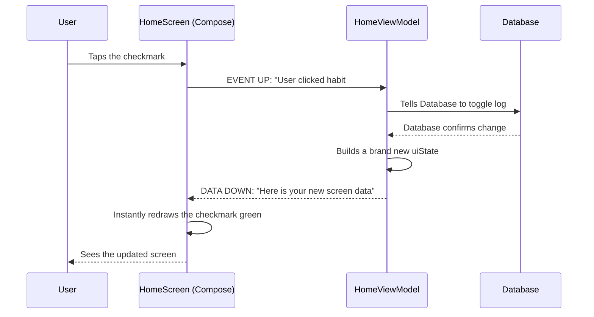

# How Jetpack Compose UI Works
### A beginner-friendly guide to HabitFlow's Visual Screens

---

## 🎨 The Big Picture: What is Jetpack Compose?

In the old days of Android development, building a screen was like building a house out of static clay. You would build the layout (XML), and then write tons of code to manually update it: *"Find the text box. Change the text to '5 days line'. Now find the button. Turn it green."*

**Jetpack Compose** is the modern way, and it works like magic ink. You tell the screen: *"Here is the data. Draw yourself based on this data."* If the data changes, the screen instantly redraws whatever parts need updating. You never manually change a button's color; you just change the data, and the button knows it should be green now.

This system is built entirely on **Composables** (functions marked with `@Composable`). These range from entire screens down to tiny reusable buttons, stacked together like Lego bricks.

Here is how the 5 files in **Section C** form the visual layer of the app.

---

## 1️⃣ NavGraph.kt — The App's Map

### What is it?
Imagine the app as a museum with different rooms. The `NavGraph` is the map at the front desk, and the `NavHostController` is your tour guide.

### Key Concepts:
- **`Screen` Sealed Class:** This is the list of all valid "URLs" or rooms in the app. A sealed class ensures no one can accidentally invent a room that doesn't exist. "Home", "Progress", and "Settings" are basic rooms. "HabitDetail" requires a ticket (the `habitId`) to enter.
- **Animations:** The NavGraph defines how screens transition. When moving forward, the new screen slides in from the right. When going back, it fades away and slides out.
- **Injection:** As you move room to room, the NavGraph hands each screen the specific ViewModel (the "brain") it needs to do its job.

---

## 2️⃣ HomeScreen.kt — The Daily Dashboard

### What is it?
The first thing you see. It lists all your habits for the day, your progress, and a "plus" button.

### Key Concepts:
- **`collectAsStateWithLifecycle`:** This is the magic link to the ViewModel. The screen acts like a radar dish listening to `uiState`. Whenever `uiState` changes (like when you finish a habit), the screen instantly refreshes physically without you having to pull down to refresh.
- **`LazyColumn`:** Imagine you have 500 habits. Loading them all at once would freeze your phone. A *Lazy* column only loads the 5 habits currently visible on your screen. As you scroll, it recycles the old ones and loads the new ones just in time.
- **`remember`:** A performance trick. Formatting today's date into text ("Wednesday, March 24") takes a tiny bit of math. We use `remember` so the screen calculates it once and caches it, instead of recalculating it 60 times a second.

---

## 3️⃣ HabitFormScreen.kt — The Dual-Purpose Editor

### What is it?
The form where you type the name, description, frequency, and pick a color for a habit.

### Key Concepts:
- **Two Jobs, One Screen:** It is used for *both* creating new habits and editing existing ones. The form looks at its data (the `uiState`)—if it sees existing data pre-loaded, it changes its title to "Edit Habit". The visual screen doesn't have to think; it just reflects the state.
- **Live Validation:** If you leave the Title blank, the text field instantly turns red and shows an error warning. This happens because every single keystroke is sent to the ViewModel, evaluated, and sent back as a new state.
- **`LaunchedEffect(uiState.isSaved)`:** This is a one-time "flare gun". The screen constantly watches `isSaved`. The moment the ViewModel successfully finishes saving the data to the database, it flips `isSaved = true`. The LaunchedEffect sees the flare, and automatically takes the user back to the previous screen.

---

## 4️⃣ HabitDetailScreen.kt — The Information Hub

### What is it?
The deep-dive profile of a single habit where you see streaks, history, and the big "Mark Complete" button.

### Key Concepts:
- **Loading State:** When you open this screen, for a fraction of a second, the database is still fetching the habit. The screen checks if the habit is `null`. If it is, it shows a spinning `CircularProgressIndicator` instead of crashing.
- **The Delete Dialog (`AlertDialog`):** The confirmation pop-up ("Are you sure you want to delete?") isn't a separate screen; it's a hidden layer on *this* screen. It only becomes visible when you set `showDeleteDialog = true`.
- **Composables inside Composables:** The screen is broken down into mini Lego blocks like `StatCard` and `SectionHeader`. This keeps the main code clean and readable.

---

## 5️⃣ ProgressScreen.kt — The Report Card

### What is it?
The global view of how well you're doing across all your habits, featuring overall streaks and colored progress bars.

### Key Concepts:
- **Dumb UI:** A great Compose screen should be "dumb." The Progress Screen does zero math. It doesn't calculate percentages or add up your streaks. It just asks the ViewModel for the final numbers and displays them nicely using a `LinearProgressIndicator` (the colored horizontal line).
- **`habitColor` Parsing:** It takes the hex color code stored in the database (like `#6750A4`) and converts it into a visual `Color` object so the progress bar perfectly matches the habit's theme.

---

## 🔄 The "State" Loop (How clicking a button actually works)

Compose architecture follows a strict rule: **Data flows down, Events flow up.** Here is the timeline of what happens when you click the "Mark Complete" button on the Home screen. All of this happens in under 1 millisecond:

## ✏️ Quick Vocabulary Recap

| Term | Plain English |
|---|---|
| **Composable** | A function that draws a specific piece of the UI (a button, a card, or a whole screen). |
| **State (`uiState`)** | A snapshot of all the data a screen needs at a specific moment in time. |
| **Recomposition** | When Compose notices `uiState` changed and automatically redraws the screen. |
| **Scaffold** | A pre-built unstyled layout that gives you proper slots for a "TopBar", a "Floating Button", and your main content. |
| **Modifier** | Instructions applied to a Composable to change how it looks or acts (like padding, color, or making it clickable). |
