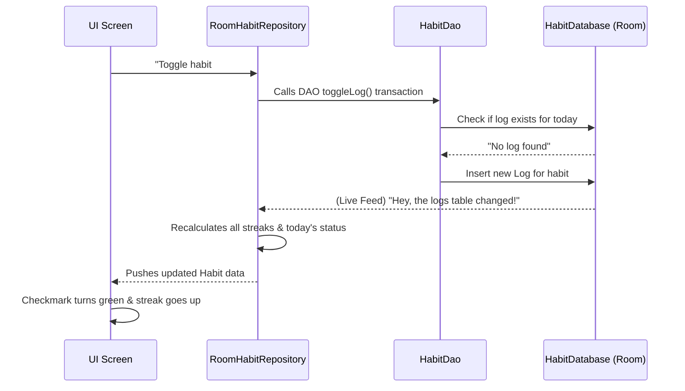

# How Local Data Persistence Works (Room)
### A beginner-friendly guide to HabitFlow's Database Storage

---

## 💾 The Big Picture: Why Do We Need a Database?

When you close an app or restart your phone, any information held in "active memory" vanishes. To make sure your habits and streaks survive, the app must write them permanently to the phone's hard drive.

In HabitFlow, we use **Room**, which is Android's official toolkit for local storage. Room acts like a highly organized **digital filing cabinet**. It uses a system called SQLite underneath, but Room hides the complicated database language (SQL) and lets developers interact with it using simple Kotlin code.

Here is how the 6 files in **Section B** work together to save and retrieve your data securely.

---

## 1️⃣ HabitDatabase — The Filing Cabinet

### What is it?
`HabitDatabase.kt` is the main vault. It tells the app: "I am a database, I have these specific drawers (tables), and this is my version number."

### Key Concepts:
- **Singleton Pattern:** Imagine if every employee in an office ordered their own separate filing cabinet. It would be chaos. The database uses a "Singleton" pattern (`HabitDatabase.getInstance()`), which ensures the app only ever creates **ONE** database connection. All screens share this single connection.
- **Versions:** If we decide to add a new "reminder time" feature next year, the database structure has to change. The `version = 2` line tells Room what shape the data should be in right now.

---

## 2️⃣ The Entities — The Spreadsheets

An **Entity** is a blueprint for a specific table in the database. Think of it like defining the columns of an Excel spreadsheet.

### `HabitEntity.kt` (The Habits List)
This table stores the physical habit (e.g., "Morning Run", purple color, daily frequency).
- **Primary Key (`id`):** Every row needs a unique ID so the database never confuses "Read a book" (ID: 1) with another "Read a book" (ID: 2). The database auto-generated this securely.

### `HabitLogEntity.kt` (The Completion History)
Every single time you tap "Complete," a new row is added here. It records *what* was completed and *when*.
- **Foreign Key:** This is a crucial rule linking the two tables. Every log *must* belong to a real habit. If the parent habit is deleted, the Foreign Key's `CASCADE` rule automatically drops all its completion logs into the shredder too. No leftover junk data!
- **Unique Index:** This is a bouncer at the door. It enforces a strict rule: "You cannot log the same habit twice on the same day." If the app accidentally tries to save a duplicate, the database silently blocks it.

---

## 3️⃣ HabitDao — The Waiter (Data Access Object)

### What is it?
If the Database is the kitchen and the Entities are the ingredients, the **DAO** (`HabitDao.kt`) is the waiter. The app doesn't go rummaging through the database itself; it places an order with the DAO.

### Key Concepts:
- **Queries:** The DAO holds the actual database instructions. For example, `@Query("SELECT * FROM habits")` tells the database to grab every row in the habits table.
- **`@Upsert`:** A smart save button. It means "**Up**date or In**sert**". If the habit is new, insert it. If it already exists, update the existing row. The app doesn't need to check which one to do.
- **`@Transaction` (Atomic logic):** When you check off a habit, the app has to check if a log exists, and then either delete it (un-compete) or insert it (complete). A `@Transaction` duct-tapes these steps into a single, unbreakable operation. If your phone crashes halfway through, the database cancels the whole thing. It guarantees your data is never left in a half-finished, corrupted state.

---

## 4️⃣ RoomHabitRepository — The Manager

### What is it?
While the DAO handles raw database rows, the rest of the app wants fully-assembled `Habit` objects with streaks calculated and ready to display. `RoomHabitRepository.kt` acts as the factory manager translating raw materials into finished products.

### Key Concepts:
- **`combine()` Pipeline:** This is the most powerful feature in the app. The repository listens to a live feed of the `habits` table AND a live feed of the `habit_logs` table. Using the `combine` function, whenever *either* table changes, the repository instantly recalculates everything (who is done today, what are the streaks) and pushes a fresh update to the screens.
- **Background Threads:** The repository forces all database reading and writing to happen on `Dispatchers.IO` (a background lane). Reading from a hard drive takes time. By doing it in the background, the main "UI lane" stays completely clear so scrolling feels silky smooth.

---

## 5️⃣ StreakCalculator — The Pure Logic

### What is it?
`StreakCalculator.kt` is a "pure function" — a piece of code that does math and nothing else. It doesn't know what a database is, and it doesn't care about colors or titles.

### Key Concepts:
- **Input / Output:** You hand it a list of dates (e.g., Monday, Tuesday, Wednesday), and it hands back a result (e.g., "Current Streak: 3, Best Streak: 3").
- **Daily vs Weekly:** 
  - For **Daily**, it counts calendar days exactly 1 day apart. If yesterday is missing, the streak goes to 0.
  - For **Weekly**, it converts dates into "ISO Weeks" (e.g., Year 2026, Week 12). If you logged the habit at least once during Week 12, and once in Week 13, that counts as 2 consecutive weeks.

---

## 🗺️ The Flow of a "Complete" Tap

To see how this all connects, here is what happens when you tap the "Done" button on a habit:

## ✏️ Quick Vocabulary Recap

| Term | Plain English |
|---|---|
| **Room** | Android's tool for reading and writing to the phone's local storage securely. |
| **Entity** | The definition of a database table (the columns in the spreadsheet). |
| **Primary Key** | The unique ID that identifies a specific row (so Habit #1 is never mixed up with Habit #2). |
| **Foreign Key** | A strict link between tables (e.g., every log *must* belong to a real habit). |
| **DAO** | "Data Access Object" — the middleman that holds the actual queries (`INSERT`, `SELECT`, `DELETE`). |
| **Transaction** | Bundling multiple database steps together so they succeed or fail as a single unit (Atomic). |
| **Singleton** | A design pattern ensuring only one database connection gets opened for the whole app. |
